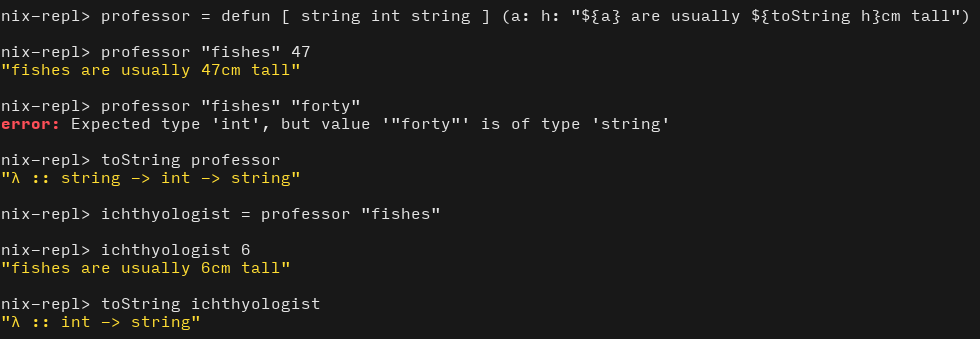

# yants

This is a tiny type-checker for data in Nix, written in Nix.

# Features

- Checking of primitive types (`int`, `string` etc.)
- Checking polymorphic types (`option`, `list`, `either`)
- Defining & checking struct/record types
- Defining & matching enum types
- Defining & matching sum types
- Defining function signatures (including curried functions)
- Types are composable! `option string`! `list (either int (option float))`!
- Type errors also compose!

Currently lacking:

- Any kind of inference
- Convenient syntax for attribute-set function signatures

## Primitives & simple polymorphism


## Structs


## Nested structs!


## Enums!


## Functions!



# Usage

1. Import into scope with `with`:

   ```nix
   {
     inputs.yants.url = "github:divnix/yants";
     outputs = inputs: {
       someType = with inputs.yants; # code using yants
     };
   }
   ```

2. Import into scope and add log context:

   ```nix
   {
     inputs.yants.url = "github:divnix/yants";
     outputs = inputs: let
       rootLogYants = inputs.yants "my-lib";
       leafLogYants = rootLogYants "leaf";
     in {
       someType = with leafLogYants; # code using yants
     };
   }
   ```

Please see my [Nix one-pager](https://github.com/tazjin/nix-1p) for more generic
information about the Nix language and what the above constructs mean.

# Stability

The current API of Yants is **not yet** considered stable, but it works fine and
should continue to do so even if used at an older version.

Yants' tests use Nix versions above 2.6 - compatibility with older versions is
not guaranteed.
